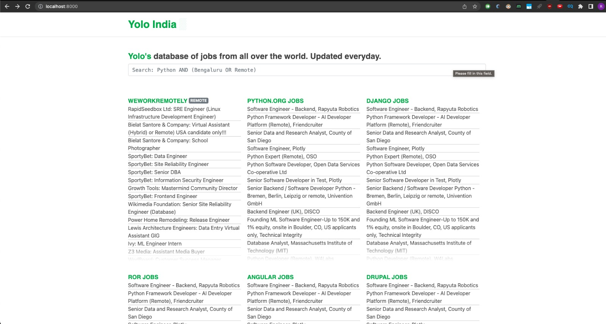

# [juno.rohitagarwal.dev](https://juno.rohitagarwal.dev)
Caerus is a RSS/JSON aggregator and search-engine for Jobs/.

The website is based on Python/Django and ElasticSearch, while the live data is ingested via NodeJS.

[<kbd></kbd>](https://juno.rohitagarwal.dev)

## How to run it (Debian)

#### Create Python Virtual Env
```
$ git clone https://github.com/rohitag13/Caerus.git
$ cd 
$ virtualenv -p python3 venv3
$ source venv3/bin/activate
$ pip3 install -r requirements.txt
```

#### Run ElasticSearch
```
$ docker-compose up -d
```

#### Setup NodeJS and start ingesting data
```
$ cd node
$ yarn install
$ yarn run ingest
```
The script will try to fetch all the default data sources, you shouldn't get any error at this stage.

#### Setup a Cron Job
You can set up a cronjob to fetch data every hour.
Just run `crontab -e` and add a line like this:
```
30 5 * * * cd /home/ubuntu/Caerus/node/ && yarn run ingest >/dev/null 2>&1
```

#### Setup and run Django server
```
$ ln -s `pwd`/dj/dev_settings.py  dj/settings.py
$ python3 manage.py migrate
$ python3 manage.py runserver
```

Now you should be able to access Caerus on you local machine on port 8000.

#### Cache
Caerus makes use of Memcached cache the home page.
It's already set up in the default settings, so you just need to
install and run Memecached:
```
$ sudo apt install memcached
$ sudo systemctl start memcached
```


## Adding RSS sources
You can add any number of RSS source url, editing the file `/sources.json`.
It should be a JSON file with a list of objects structured like this one:
```json
{
    "name": "StackOverflow Jobs",
    "url": "https://stackoverflow.com/jobs/feed",
}
```


## Elasticsearch Mappings
Elasticsearch works out of the box with any JSON blob of data.
But to get decent search results and index only what is necessary, you might
want to setup the object mappings.
Caerus uses an "rss" index and a "item" doc_type.
You can configure the mappings doing this `PUT` request:

`PUT http://localhost:9200/rss/item/`
```json
{
  "item": {
    "properties": {
      "title": {
        "type": "text",
        "analyzer": "english"
      },
      "body": {
        "type": "text",
        "analyzer": "english"
      },
      "body_html": {
        "type": "keyword"
      },
      "category": {
        "type": "keyword"
      },
      "link": {
        "type": "keyword"
      },
      "pubDate": {
        "type": "date"
      },
      "source": {
        "type": "keyword"
      }
    }
  }
}
```


More resources:

* http://www.hnhiring.me/ - https://hnrss.github.io/#job-feeds
* https://app.remotesome.com/api/user-service/public/jobs/list?perPage=30&page=1


#### Deploy:
```
gunicorn --bind 0.0.0.0:8000 dj.wsgi --workers 3
```
On another tab:
```
cd node
node ingest.js
```
